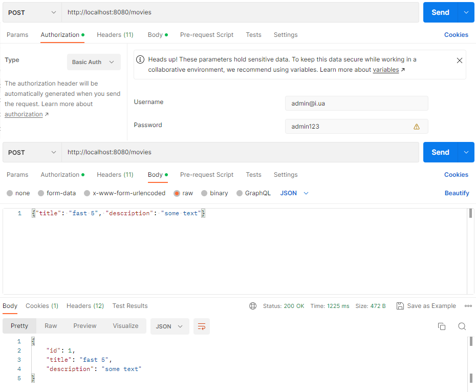
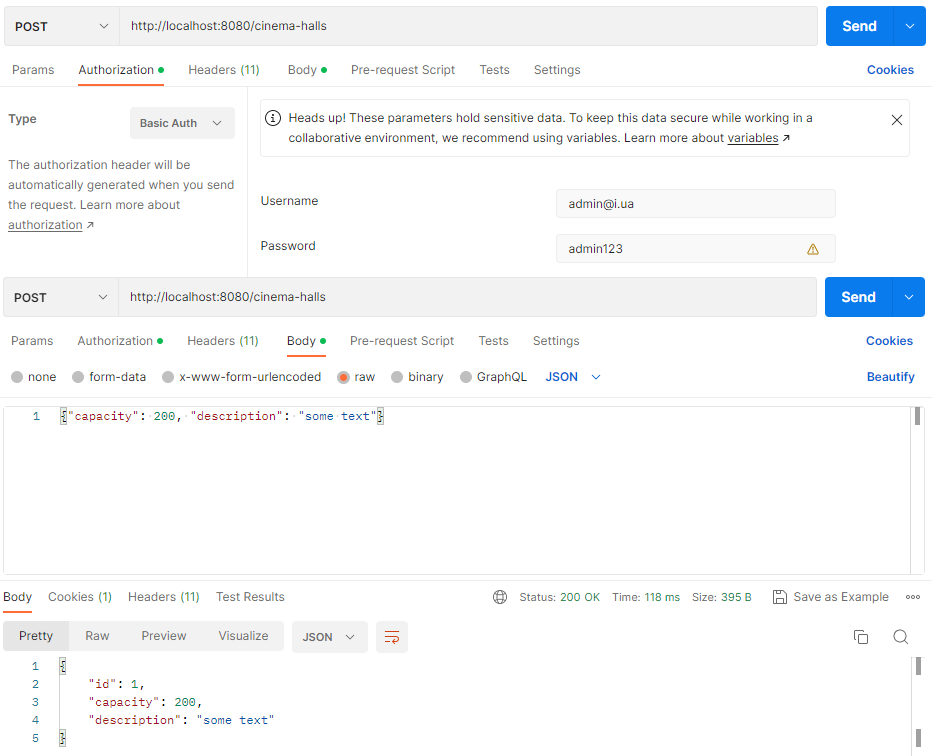
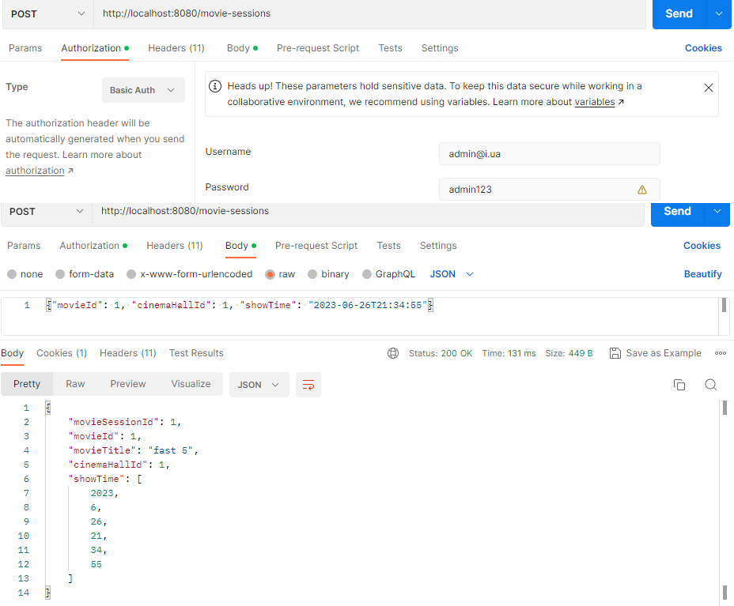
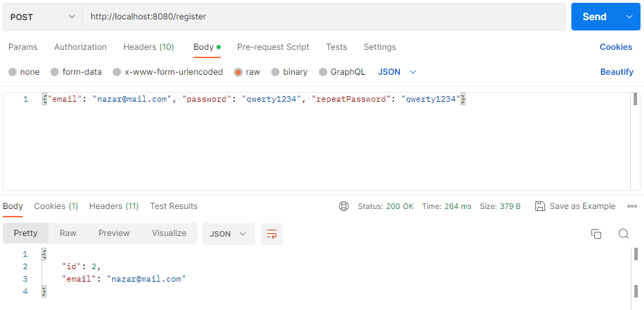
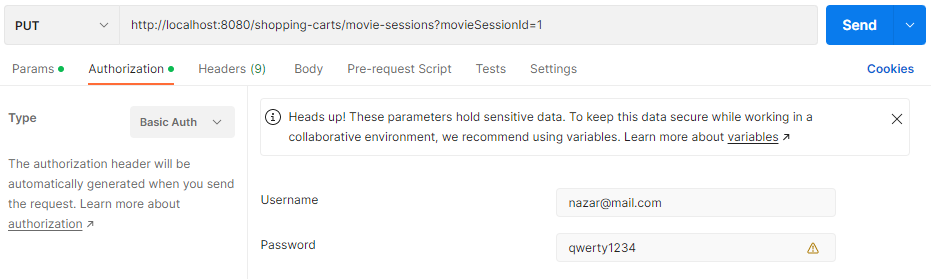
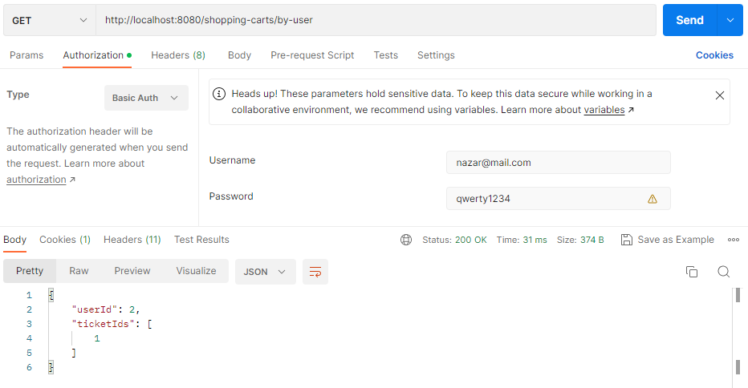
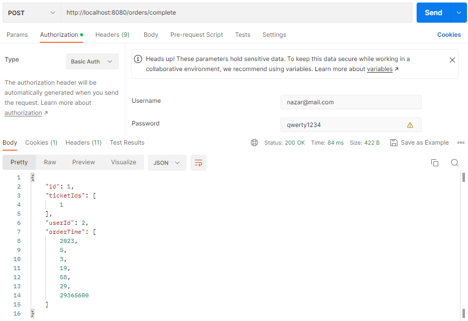


# Cinema-app
This project is an imitation of the operation of a cinema. The program is developed according to the concept of REST and using frameworks Spring and Hibernate.
# Features
* Before use the system, users need to login
* Everyone can register new user
* Admin can see users
* Admin can add and get movies, also user can only get movies 
* Admin can add and get cinema hall, also user can only get cinema hall  
* Admin can add, update, delete and get movie session, also user can only get movie session 
* User can add session to him own shopping cart and get it shopping cart
* User can complete him order and get him orders history
# Getting Started
* Clone repository with GitHub
* Create an empty database
* In db.properties replace the values of the ```YOUR_DRIVER```, ```YOUR_DATABASE_URL```, ```YOUR_ROOT```, ```YOUR_PASSWORD``` and ```YOUR_DIALECT``` properties with the appropriate values for your database setup
* Build the project using Maven: ```mvn clean install```
* Deploy the generated WAR file to servlet container such as Tomcat
# Model structure

# Structure
* config: classes for configuration of application operation
* controller: Servlets that handle HTTP requests and responses
    - AuthenticationController - POST ```/register``` - register new user
    - CinemaHallController - POST ```/cinema-halls``` - add cinema-hall
    - CinemaHallController - GET ```/cinema-halls``` - get all cinema-halls
    - MovieController - POST ```/movies``` - add movie
    - MovieController - GET ```/movies``` - get all movies
    - MovieSessionController - POST ```/movie-sessions``` - add movie-session
    - MovieSessionController - GET ```/movie-sessions/available``` - get available movie-session
    - MovieSessionController - PUT ```/movie-sessions/{id}``` - update movie-session
    - MovieSessionController - DELETE ```/movie-sessions/{id}``` - delete movie-session
    - UserController - GET ```/users/by-email``` - get user by username
    - ShoppingCartController - GET ```/shopping-carts/by-user``` - get all movie-session in current user shopping cart
    - ShoppingCartController - PUT ```/shopping-carts/movie-sessions``` - add movie-session to current user shopping cart
    - OrderController - POST ```/orders/complete``` - complete user order
    - OrderController - GET ```/orders``` - show all order history for current user
* dao: Data Access Object interfaces and their implementations
* dto: Data Transfer Object 
* exception: My current exception for working with the database
* lib: My own annotations for data validation
* model: Contains classes that represent data models
* service: Service interfaces and their implementations that perform business logic
* security: Custom implementation UserDetailService
* util: Utility class used in a project to pattern date
# Testing program in POSTMAN
* Add movie

* Add cinema hall

* Add movie-session

* Register user

* Add movie-session to shopping cart

* Get movie-session from shopping cart

* Complete order

# Also, you can use my POSTMAN request [collection](https://warped-trinity-563512.postman.co/workspace/Nazar~f0c56656-ead1-4c1b-bab6-7b33d2e9a2ed/collection/7321309-0945856c-34ad-4001-826c-be0f39167396?action=share&creator=7321309)
# Used technologies
* Java ```v.17.0.5```
* Maven ```v.3.8.7```
* Spring ```v.5.3.20```
* Hibernate ```v.5.6.14.Final```
* MySql ```v.8.0.22```
* Java Servlets ```v.4.0.1```
* Jackson core ```v.2.14.1```
* Javax annotation ```v.1.3.2```
* Tomcat ```v.9.0.50```
# Authors
Nazar Zvarych
